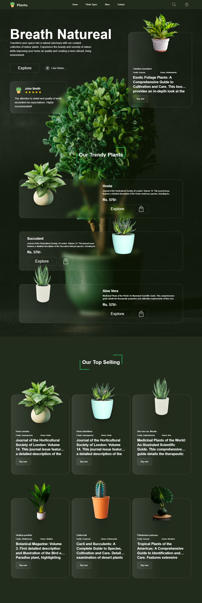

<h3>Personal Study Projects</h3>

  

    <h4
      style="
        margin: 0 0 1rem 0;
        font-size: 1.2rem;
        font-weight: 600;
        color: #1B2316;
        max-width: 100%;
        overflow: hidden;
        text-overflow: ellipsis;
        white-space: nowrap;
      "
    >
      🪴 Breath Natural - NextJS Chronicles
    </h4>
    
    

      <a
        href="https://breath-natural-nextjs-chronicles.netlify.app"
        target="_blank"
        style="
          display: inline-block;
          padding: 0.5rem 1rem;
          background: #0070f3;
          color: white;
          text-decoration: none;
          border: 1px solid #0070f3;
          border-radius: 4px;
          margin-bottom: 1rem;
          transition: background 0.3s ease;
        "
        onMouseOver="this.style.backgroundColor='#0052cc'"
        onMouseOut="this.style.backgroundColor='#0070f3'"
        title="Click to view the Breath Natural project"
        aria-label="Click to view the Breath Natural project"
      >
        View Project →
      </a>
    

    

      
      
      
      
    

    

      <h5 style="margin: 0 0 0.5rem 0;">What I Learned:</h5>
      <ul style="
        margin: 0;
        padding-left: 1.2rem;
        list-style-type: disc;
      ">
        <li>Next.js 14 App Router implementation</li>
        <li>Server and Client Components</li>
        <li>API Route Handlers</li>
        <li>Server Actions</li>
        <li>Advanced TypeScript patterns</li>
      </ul>
    

  

  

    <h4 style="margin: 0 0 1rem 0;">🍽️ Food Hut - Angular Chronicles</h4>
    
    

      <a
        href="https://food-hut-angular-chronicles-1.netlify.app/"
        target="_blank"
        style="
          display: inline-block;
          padding: 0.5rem 1rem;
          background: #dd0031;
          color: white;
          text-decoration: none;
          border-radius: 4px;
          margin-bottom: 1rem;
          transition: background 0.3s ease;
        "
        onMouseOver="this.style.backgroundColor='#8b0000'"
        onMouseOut="this.style.backgroundColor='#dd0031'"
        title="Click to view the Food Hut project"
        aria-label="Click to view the Food Hut project"
      >
        View Project →
      </a>
    

    

      
      
      
    

    

      <h5 style="margin: 0 0 0.5rem 0;">What I Learned:</h5>
      <ul style="
        margin: 0;
        padding-left: 1.2rem;
        list-style-type: disc;
      ">
        <li>Angular 17 new features</li>
        <li>Signals and computed values</li>
        <li>Control flow syntax</li>
        <li>Standalone components</li>
        <li>Performance optimization techniques</li>
      </ul>
    

  

<h3>Collaborations</h3>

  
Corporative Projects  with <a href="https://labi9.com" target="_blank" aria-label="Labi9.com">Labi9.com</a> (2021 - Until December 2024)

  

    

      

        I will be highlighting the latest projects in which I actively participated, and remember, in the development of the front:
      

      <ul>
        <li>
          <a
            href="https://labi9.com/"
            target="_blank"
            aria-label="Labi9.com"
          >
            Labi9.com
          </a>
            
          

            
Labi9.com Preview

            
          

          

            
            
            
            
            
            
            
          

        </li>
        <li>
          <a
            href="https://loor.vc/"
            target="_blank"
            aria-label="Loor.vc"
          >
            Loor.vc
          </a>
            
          

            
Loor.vc Preview

            
          

          

            
            
            
            
          

        </li>
        <li>
          <a
            href="https://painel.loor.vc/investor/login"
            target="_blank"
            aria-label="Painel.loor.vc"
          >
            Painel.loor.vc - Financial Admin Dashboard
          </a>
            
          

            
Painel.loor.vc Preview

            
          

          

            
            
            
            
          

        </li>
        <li>
          <a
            href="https://www.glbk.com.br/"
            target="_blank"
            aria-label="Global Liberty Bank"
          >
            Global Liberty Bank
          </a>
            
          

            
Global Liberty Bank Preview

            
          

          

            
            
            
          

        </li>
        <li>
          <a
            href="https://tippbank.com.br/"
            target="_blank"
            aria-label="Tippbank.com.br"
          >
            Tippbank.com.br
          </a>
            
          

            
Tippbank.com.br Preview

            
          

          

            
            
            
            
            
          

        </li>
      </ul>
    

  

<h3>Freelance Projects</h3>

  
Freelance Projects

  

    

      <h3>
        Coming soon
      </h3>
    

  

# 💻 Tech Stack

		
		
		
		
		
		
		
		
		
		
		
		
		
		
		
		
		
		
		
		
		
		
		
		
		
		
		
		
		
		
		
		
		
		
		
		
	

# 📦 GitHub Stats

  

  
  

# 🌟 Core Principles

- 📱 Mobile-First Development
- ♿ WCAG Accessibility Standards
- 🎯 Clean & Maintainable Code
- 🚀 Performance Optimization
- 🔄 Continuous Learning

# 🤝 Let's Connect

  
  
  
  
  

#

 <h3>Currently Studying:</h3>
 		

#

 
 

 

  <h3>Open for exciting opportunities and collaborations! 🚀</h3>

---

  

