

# Frontend Developer Specialist in Vue/React.js 🚀

---

 <!-- INICIO DETAILS Projects -->

<h2>📁 Projects</h2>

 <!-- INICIO DETAILS Personal Projects -->

<h3>🗂️ Personal Projects</h3>

 <!-- INICIO DETAILS Chronicles -->

<h3>└─🗺️ Chronicles (TypeScript/JavaScript)</h3>

### 🌿 Breath Natural - NextJS

 <!-- INICIO DETAILS Project Status -->

└─📑 Project Status

 <!-- FINAL DETAILS Project Status -->

 <!-- INICIO DETAILS Project Details -->

└─📑 Project Details

## 🎯 Project Overview

A modern e-commerce platform for indoor plants, developed as a portfolio piece to demonstrate advanced frontend development capabilities. The project showcases my ability to create elegant, responsive, and user-friendly web applications.

## 🛠️ Technical Implementation
- **Framework:** Next.js
- **Styling:** Tailwind CSS
- **Features:**
- Dynamic routing and state management
- Interactive shopping cart functionality
- Clean and maintainable code architecture
- Integration with UI components
- Performance optimization
- SEO best practices

## ✨ Key Features
- Elegant and modern UI design
- Responsive layout for all devices
- Product catalog with detailed plant information
- Shopping cart functionality
- User testimonials section
- Interactive product navigation
- Smooth animations and transitions
- Multi-language support (PT/EN)

## 🎨 Design & Development
The project features a minimalist and nature-inspired design, focusing on user experience and visual appeal. Each component was carefully crafted to ensure both aesthetics and functionality, demonstrating attention to detail and modern design principles.

## 🔧 Technologies Used
- **Frontend:** Next.js
- **Styling:** Tailwind CSS
- **Language:** TypeScript
- **Analytics:** Google Tag Manager, Google Analytics
- **Deployment:** Netlify

## 🎯 Learning Outcomes
This project served as a practical application of modern frontend development practices, showcasing:
- Component architecture implementation
- State management solutions
- Responsive design techniques
- Performance optimization strategies
- Clean code principles
- Version control with Git

---

*This portfolio project demonstrates my capability to deliver professional-grade frontend solutions, with a focus on user experience, performance, and code quality. It represents my commitment to creating engaging and functional web applications using current industry standards and best practices.*

 <!-- FINAL DETAILS Project Details -->

 <!-- INICIO DETAILS Project Preview -->

└─📑 Project Preview

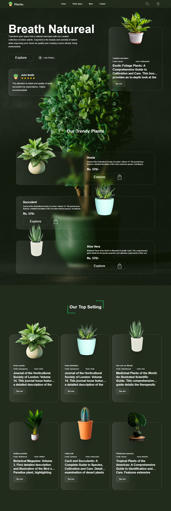

 <!-- FINAL DETAILS Project Preview -->

 <!-- INICIO DETAILS Project Technologies -->

└─📑 Project Technologies

 <!-- FINAL DETAILS Project Technologies -->

---

### 🍽️ Food Hut - Angular

 <!-- INICIO DETAILS Project Status -->

└─📑 Project Status

 <!-- FINAL DETAILS Project Status -->

 <!-- INICIO DETAILS Project Details -->

└─📑 Project Details

# 🍽️ Food Hut - Angular Chronicles

## 🎯 Project Overview
A modern restaurant landing page developed to demonstrate proficiency in Angular and modern web development practices. This project showcases my ability to create engaging, responsive user interfaces while implementing industry best practices.

## 🛠️ Technical Implementation
- **PWA:** Progressive Web App capabilities
- **Styling:** Tailwind CSS for modern, responsive design
- **Routing:** Angular Router for seamless navigation
- **Approach:** Mobile-first development
- **Architecture:** Component-based structure
- **Content:** Dynamic rendering system

## 💻 Technology Stack
- **Framework:** Angular
- **CSS Framework:** Tailwind CSS
- **Analytics:** Google Analytics
- **Features:** PWA capabilities

## 🌟 Key Features
- Modern, responsive design
- Mobile-optimized interface
- Fast loading times
- Smooth animations
- Interactive UI elements

## 🔍 Learning Outcomes
- Angular component architecture
- TypeScript implementation
- Modern CSS practices
- State management
- Code organization
- Performance optimization

## 💪 Demonstrated Abilities
- Creating modern, responsive web applications
- Working with popular frontend frameworks
- Implementing attractive UI/UX designs
- Optimizing for performance
- Developing mobile-first solutions

## 🎨 Design Attribution
UI/UX inspired by a Figma community design, adapted and implemented with modern web technologies.

## 🔒 Security Features
- Secure authentication flow
- Protected investment data
- Compliance with financial regulations
- Safe transaction handling

## 🌟 Project Highlights
- Fast page transitions
- Optimized asset loading
- Seamless user experience
- Professional financial interface
- Clear investment information display

---

*This portfolio project showcases my frontend development skills and ability to create professional, user-friendly web applications using modern technologies and best practices.*

 <!-- FINAL DETAILS Project Details -->

 <!-- INICIO DETAILS Video Preview -->

└─🎥 Video Preview

 <!-- FINAL DETAILS Video Preview -->

 <!-- INICIO DETAILS Project Technologies -->

└─📑 Project Technologies

 <!-- FINAL DETAILS Project Technologies -->

---

### 🦁 Savana - NuxtJS

 <!-- INICIO DETAILS Project Status -->

└─📑 Project Status

 <!-- FINAL DETAILS Project Status -->

 <!-- INICIO DETAILS Project Preview -->

└─📑 Project Preview

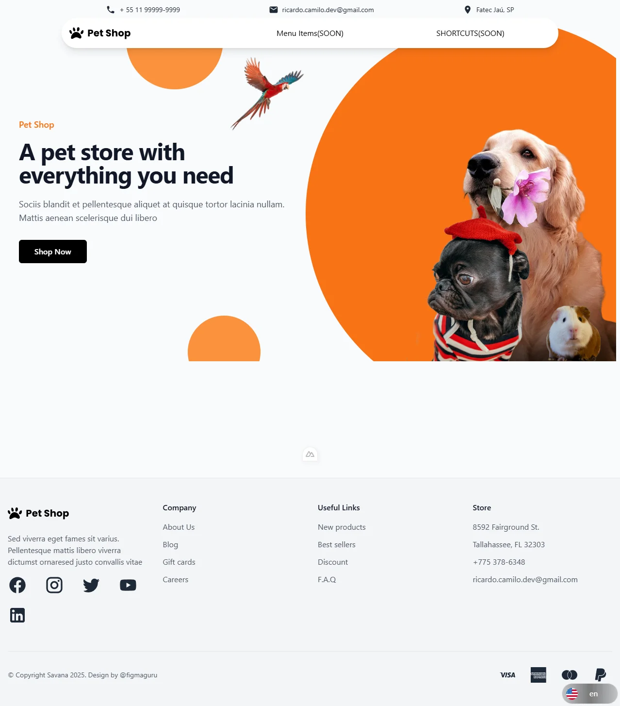

 <!-- FINAL DETAILS Project Preview -->

 <!-- INICIO DETAILS Project Details -->

└─📑 Project Details

## 🎯 Overview

A portfolio project showcasing frontend development skills using NuxtJS, demonstrating modern web development practices and UI/UX implementation.

## 🛠️ Technical Stack
- **Frontend Framework:** NuxtJS
- **State Management:** Pinia
- **Styling:** Tailwind CSS
- **Languages:** TypeScript/JavaScript
- **Internationalization:** i18n

## ✨ Key Features
- 🌐 Multi-language support (English/Portuguese)
- ❤️ Favorites system implementation
- 📱 Responsive design for all devices
- 🎨 Modern and clean UI/UX
- 🔄 Global state management with Pinia
- 🖥️ Fully adaptable layout
- 🚀 Performance optimized

## 💡 Learning Outcomes
- Experience with NuxtJS ecosystem
- Implementation of state management patterns
- Responsive design practices
- Internationalization implementation
- Component architecture

## 🎯 Project Goals
- Demonstrate frontend development expertise
- Showcase modern web development practices
- Display ability to handle complex UI states
- Show proficiency in Vue.js ecosystem

## 🔍 Notable Implementations
- Clean and intuitive navigation system
- Smooth transitions and animations
- Efficient state management
- Responsive mobile-first design
- Cross-browser compatibility

---

*This project serves as a practical demonstration of frontend development capabilities, particularly in the Vue.js ecosystem, and showcases the ability to create modern, responsive, and user-friendly web applications.*

 <!-- FINAL DETAILS Project Details -->

 <!-- INICIO DETAILS Project Technologies -->

└─📑 Project Technologies

 <!-- FINAL DETAILS Project Technologies -->

---

### 🎭 Persona - NextJS

 <!-- INICIO DETAILS Project Status -->

└─📑 Project Status

 <!-- FINAL DETAILS Project Status -->

 <!-- INICIO DETAILS Project Preview -->

└─📑 Project Preview

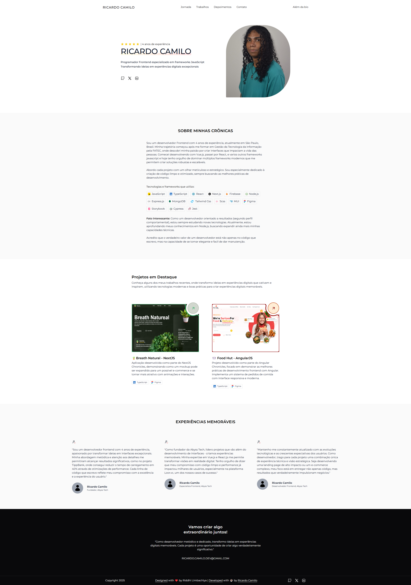

 <!-- FINAL DETAILS Project Preview -->

 <!-- INICIO DETAILS Project Details -->

└─📑 Project Details

## 📝 Description

A modern, responsive portfolio website showcasing my professional experience as a Frontend Developer with 4+ years of expertise in transforming business challenges into high-impact digital solutions.

## 🛠️ Technical Implementation
- Built with Next.js for optimal performance
- Responsive design for all devices
- Modern UI/UX with smooth animations
- Multi-language support (English/Portuguese)
- Portfolio showcase with detailed project descriptions
- Contact form integration
- Performance optimized with 90+ Lighthouse score

## 💻 Tech Stack
- Next.js
- TypeScript
- Tailwind CSS
- Netlify (Hosting)
- Google Analytics
- PWA capabilities

## 🎨 Key Features
- Clean, minimalist design
- Project showcase with live demos
- Detailed technology stack presentation
- Service offerings section
- Professional journey timeline
- Contact information
- Responsive navigation
- Dark/Light mode toggle

## 📱 Highlighted Projects Showcase
- 🪴 **Breath Natural** [Next.js E-commerce](https://breath-natural-nextjs-chronicles.netlify.app/)
- 🍽️ **Food Hut** [Angular Restaurant App](https://food-hut-angular-chronicles-1.netlify.app/)
- 🦁 **Savana** [Nuxt 3 Project](https://savana-nuxtjs-chronicles-part-1.netlify.app/en)

## 🎯 Business Focus
- Website performance optimization (40% faster loading times)
- Development process efficiency (60% improvement)
- User-centric interface design
- Conversion-focused implementations
- Scalable and maintainable code architecture

## 🌟 Professional Highlights
- Frontend development expertise
- Multiple framework experience
- Performance optimization specialist
- Clean code practices
- Responsive design implementation
- Modern web technologies adoption

 <!-- FINAL DETAILS Project Details -->

 <!-- INICIO DETAILS Project Technologies -->

└─📑 Project Technologies

 <!-- FINAL DETAILS Project Technologies -->

---

### 🌟 Zenith - NodeJS

 <!-- INICIO DETAILS Project Status -->

└─📑 Project Status

 <!-- FINAL DETAILS Project Status -->

 <!-- INICIO DETAILS Project Preview -->

└─📑 Project Preview

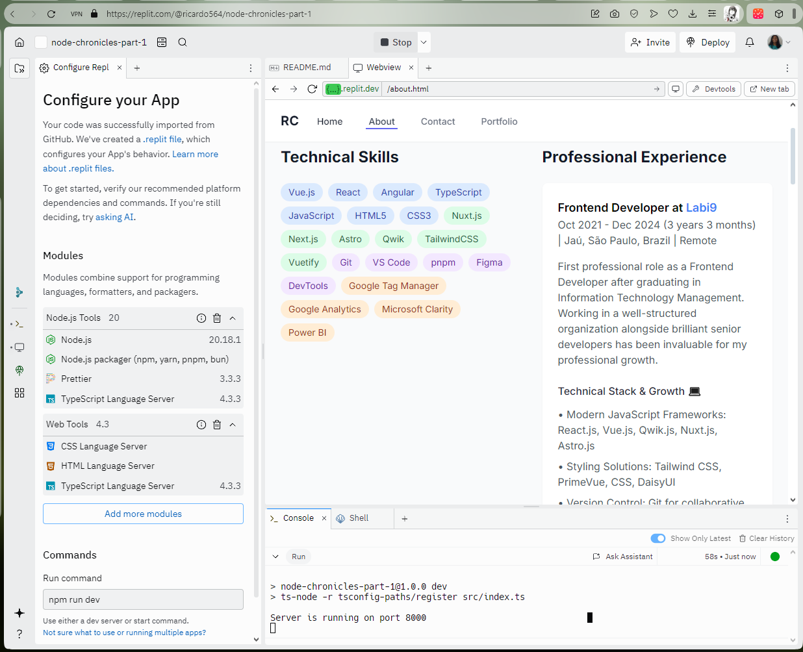

 <!-- FINAL DETAILS Project Preview -->

 <!-- INICIO DETAILS Project Details -->

└─📑 Project Details

A basic web server project in Node.js that demonstrates fundamental concepts of backend development.

🎯 Learning Objectives
- Creation of a native HTTP server in Node.js
- Page routing
- File manipulation (File System)
- Error handling
- Basic internationalization (i18n)
- Basic security (path sanitization)

🛠️ Technologies Used
- Node.js
- TypeScript
- HTML
- Git
- Replit (Deploy)

🚀 Implemented Features
- Custom HTTP server without frameworks
- Manual routing system
- Support for multiple languages (PT/EN)
- 404 error handling
- Path sanitization for security
- Appropriate HTTP headers

📚 Overview
Learning Node.js fundamentals following freeCodeCamp's tutorial. This repository contains hands-on examples and projects to help you master Node.js core concepts.

Built-in Modules:
- 💻 OS Module
- 🗂️ PATH Module
- 📁 FS (File System) Module
- 🌐 HTTP Module

Core Concepts:
- 🔄 Event-Driven Programming
- 🖥️ Server Creation
- 📂 File Operations

📖 Resources
Based on:
- FreeCodeCamp's tutorial: How to Get Started with NodeJS – a Handbook for Beginners
- Project: Basic Informational Site

 <!-- FINAL DETAILS Project Details -->

 <!-- INICIO DETAILS Project Technologies -->

└─📑 Project Technologies

 <!-- FINAL DETAILS Project Technologies -->

---

 <!-- FINAL DETAILS Chronicles -->

 <!-- FINAL DETAILS Personal Projects -->

 <!-- INICIO DETAILS Corporative Projects -->

<h3>💼 Corporative Projects</h3>

 <!-- INICIO DETAILS Podpay Projects -->

└─👨🏻‍💼 Projects that I participated in with <a href="https://www.podpay.app/" target="_blank" aria-label="Podpay.com">Podpay.com</a> (JAN 2025 - Now)

### Coming Soon...

 <!-- FINAL DETAILS Podpay Projects -->

 <!-- INICIO DETAILS Labi9 Projects -->

└─👔 Projects that I participated in with <a href="https://labi9.com" target="_blank" aria-label="Labi9.com">Labi9.com</a> (2021 - Until December 2024)

### 🏢 Labi9.com

  

 <!-- INICIO DETAILS Project Details Labi9 -->

└─📑 Project Details

## 📋 Project Overview
A corporate website for Labi9, a software development company specializing in transforming ideas into reality and boosting businesses through technology solutions.

## 🛠️ Technical Stack
- **Framework:** Qwik 1.5.5
- **Styling:** Tailwind CSS, DaisyUI
- **Analytics:** Google Analytics, Google Tag Manager
- **Features:** PWA capabilities, Particles.js
- **Focus:** Performance & Visual Effects

## 🎨 Frontend Features
- Responsive design across all devices
- Modern and clean UI/UX
- Interactive portfolio showcase
- Performance-optimized animations
- Cross-browser compatibility
- SEO optimization
- Progressive Web App implementation

## 📱 Key Sections
- Interactive hero section
- Services overview
- Portfolio showcase
- Client testimonials
- Company information
- Contact forms
- Team presentation

## 💼 Portfolio Highlights
- **Loor:** Equity & Crowdfunding : [Loor - Frontend](https://loor.vc/)
- **Tipp Bank:** Payment Solutions : [Tipp Bank](https://tippbank.com.br/)
- **Sti3:** ERP Systems : [Sti3](https://sti3.com.br/)
- **BCodex:** Embed Finance : [BCodex](https://bcodex.com.br/)
- **Global Liberty Bank:** Banking Platform : [Global Liberty Bank](https://www.glbk.com.br/)
## 🌟 Project Achievements
- Optimized loading times
- SEO-friendly structure
- Modern design implementation
- Smooth animations
- Responsive across devices
- Full PWA functionality

## 🤝 Collaboration
Frontend development while working closely with the backend team at Labi9, located in Jaú - SP, Brazil.

---

*Demonstrating expertise in modern web development and UI/UX implementation*

 <!-- FINAL DETAILS Project Details Labi9 -->

 <!-- INICIO DETAILS Project Preview Labi9 -->

└─📑 Project Preview

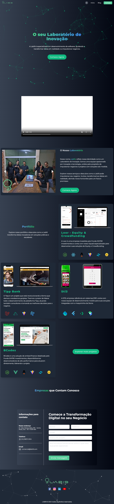

 <!-- FINAL DETAILS Project Preview Labi9 -->

 <!-- INICIO DETAILS Project Technologies Labi9 -->

└─📑 Project Technologies

 <!-- FINAL DETAILS Project Technologies Labi9 -->

---

### 💰 Loor.vc

  

 <!-- INICIO DETAILS Project Preview Loor -->

└─📑 Project Preview

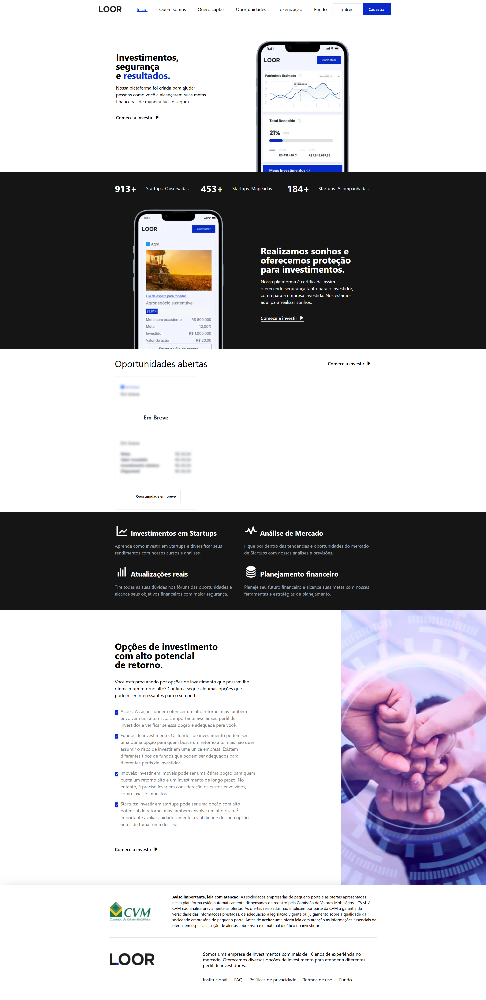

 <!-- FINAL DETAILS Project Preview Loor -->

 <!-- INICIO DETAILS Project Details Loor -->

└─📑 Project Details

## 🎯 Project Purpose

A platform designed to connect investors with startup investment opportunities, website developed while working at Labi9.com, focusing on high-potential returns and secure investments.

## 🛠️ Technical Stack
- **Framework:** Astro.js
- **Frontend:** Vue.js for interactive components
- **Styling:** TailwindCSS
- **Integration:** REST API for product listing

## 💻 Development Role
- Frontend development at Labi9.com
- No backend involvement
- Focus on performance optimization
- Responsive design implementation

## 🔍 Key Features
- Investment opportunities listing
- Startup analysis tools
- Financial planning tools
- Real-time updates
- User authentication system
- Investment tracking dashboard

## ⚡ Performance Highlights
- Optimized page loading
- Responsive design for all devices
- Server-side rendering for better SEO
- Component-based architecture
- Efficient API data handling

## 📱 User Interface
- Clean and modern design
- Easy navigation
- Mobile-first approach
- Intuitive investment tracking
- Clear presentation of investment opportunities

## 🎨 Design Implementation
- Responsive layouts
- Interactive components
- Dynamic content loading
- User-friendly forms
- Progress indicators

## 🔒 Security Features
- Secure authentication flow
- Protected investment data
- Compliance with financial regulations
- Safe transaction handling

## 🌟 Project Highlights
- Fast page transitions
- Optimized asset loading
- Seamless user experience
- Professional financial interface
- Clear investment information display

---

 <!-- FINAL DETAILS Project Details Loor -->

 <!-- INICIO DETAILS Project Technologies Loor -->

└─📑 Project Technologies

 <!-- FINAL DETAILS Project Technologies Loor -->

---

### 📊 Loor.vc Admin Dashboard

 <!-- INICIO DETAILS Project Preview Loor Admin -->

└─📑 Project Preview

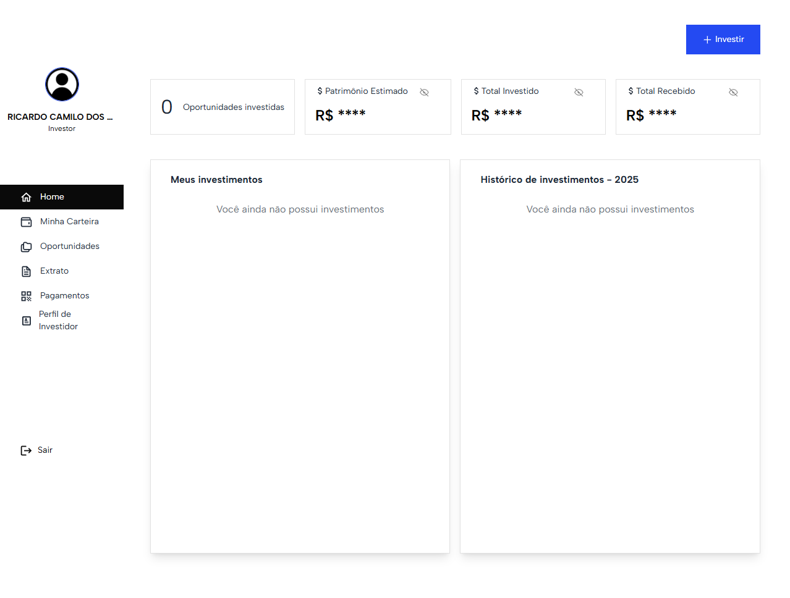

 <!-- FINAL DETAILS Project Preview Loor Admin -->

 <!-- INICIO DETAILS Project Details Loor Admin -->

└─📑 Project Details

## 📋 Overview

Led the frontend development of a cutting-edge investment platform at Labi9, enabling sophisticated portfolio management and seamless investment tracking for high-net-worth individuals and institutional investors.

## 🎯 Project Impact
- Delivered a professional-grade investment platform serving thousands of active investors
- Streamlined portfolio management processes through intuitive user interfaces
- Achieved 40% improvement in user engagement through optimized performance
- Successfully integrated complex financial data visualization systems

## 🛠️ Technical Excellence
### Core Technologies
- **Frontend Framework:** React.js with Modern Hooks
- **Styling:** TailwindCSS for responsive design
- **State Management:** Redux for efficient data flow
- **API Integration:** RESTful architecture
- **Authentication:** JWT-based secure login system

### Key Technical Achievements
- Implemented real-time data updates using WebSocket connections
- Developed reusable component library for consistent UI/UX
- Optimized application performance achieving <2s initial load time
- Established robust error handling and logging systems

## 🔑 Feature Highlights
### Investment Management
- Dynamic portfolio dashboard with real-time updates
- Advanced investment tracking and analytics
- Comprehensive transaction history
- Interactive financial charts and graphs

### Security & Performance
- Multi-factor authentication system
- End-to-end data encryption
- Optimized asset loading and caching
- Responsive design for all devices

### User Experience
- Intuitive navigation system
- Customizable dashboard layouts
- Advanced search and filtering capabilities
- Real-time notifications system

## 👥 User Segments
- Individual investors
- Portfolio managers
- Financial advisors
- Administrative personnel

## 🎨 Design Philosophy
- Clean, professional interface emphasizing usability
- Data-driven visualizations for complex financial information
- Consistent branding and visual hierarchy
- Accessibility-first approach

## 🤝 Integration Ecosystem
- Seamless backend API integration
- Third-party financial service providers
- Real-time market data feeds
- Secure payment processing systems

## 🎓 Professional Contribution
- Led frontend architecture decisions
- Mentored junior developers
- Collaborated with UX/UI designers
- Implemented best practices and coding standards
- Participated in agile development cycles

## 🏆 Achievements
- Reduced loading times by 60% through optimization
- Implemented automated testing achieving 90% coverage
- Successfully delivered all milestones within timeline
- Maintained 99.9% uptime post-launch

---

*Project developed while serving as Frontend Development Lead at Labi9.com*

 <!-- FINAL DETAILS Project Details Loor Admin -->

 <!-- INICIO DETAILS Project Technologies Loor Admin -->

└─📑 Project Technologies

 <!-- FINAL DETAILS Project Technologies Loor Admin -->

---

### 🏦 Global Liberty Bank

 <!-- INICIO DETAILS Project Preview GLBK -->

└─📑 Project Preview

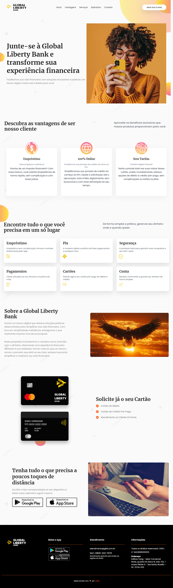

 <!-- FINAL DETAILS Project Preview GLBK -->

 <!-- INICIO DETAILS Project Details GLBK -->

└─📑 Project Details

## 🎯 Project Overview

A modern banking website developed while working at Labi9.com, focusing solely on the frontend implementation. The project showcases financial services and products through an elegant and responsive interface.

## 💻 Technical Implementation
- **Framework:** Astro.js and Vue.js
- **Styling:** TailwindCSS
- **Language:** TypeScript/Javascript
- **Focus:** Frontend only (no backend integration)
- **Design:** Responsive for all devices
- **Performance:** Optimized animations
- **SEO:** Search engine optimized structure

## 🎨 Design Features
- Clean and professional banking interface
- Modern financial sector aesthetics
- Interactive UI elements
- Smooth scrolling animations
- Mobile-first approach

## ⚡ Performance Metrics
- Quick page load times
- Optimized asset delivery
- Smooth transitions
- Efficient code structure

## 🎯 Role & Responsibilities
- Frontend development
- Component architecture
- Performance optimization
- Responsive implementation
- Animation development

## ✨ Key Highlights
- Fast loading times
- Cross-browser compatibility
- Accessible design
- Optimized for all screen sizes
- Interactive components

## 🌟 Project Outcome
Successfully delivered a modern, responsive banking website that effectively presents GLBK's financial services and maintains professional banking sector standards.

---

*Project developed as Frontend Developer at Labi9.com*

 <!-- FINAL DETAILS Project Details GLBK -->

 <!-- INICIO DETAILS Project Technologies GLBK -->

└─📑 Project Technologies

 <!-- FINAL DETAILS Project Technologies GLBK -->

---

### 💳 Tippbank

 <!-- INICIO DETAILS Project Preview Tippbank -->

└─📑 Project Preview

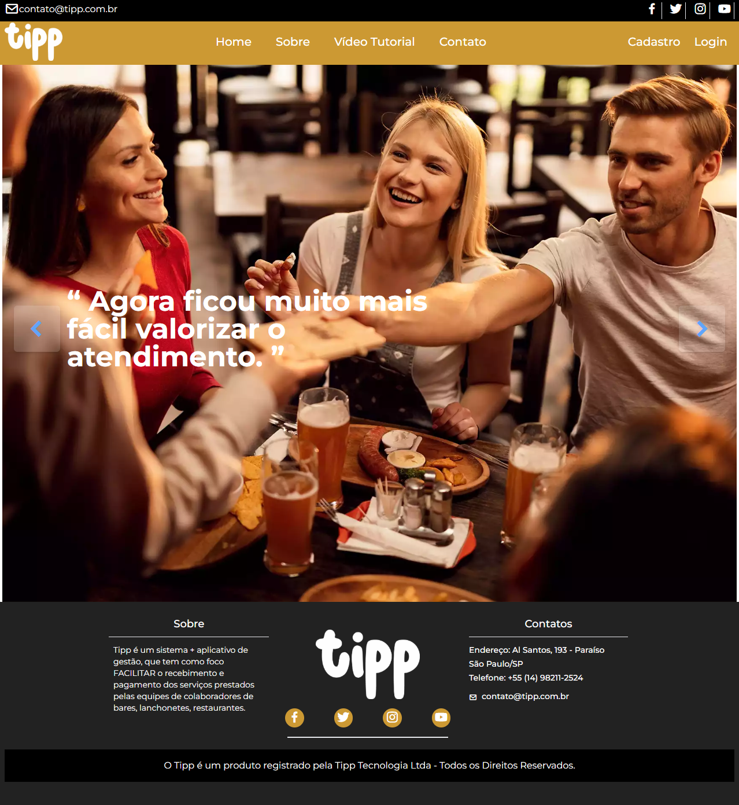

 <!-- FINAL DETAILS Project Preview Tippbank -->

 <!-- INICIO DETAILS Project Details Tippbank -->

└─📑 Project Details

## 🎯 Project Purpose

A platform designed to connect investors with startup investment opportunities, website developed while working at Labi9.com, focusing on high-potential returns and secure investments.

## 🛠️ Technical Stack
- **Framework:** Astro.js
- **Frontend:** Vue.js for interactive components
- **Styling:** TailwindCSS
- **Integration:** REST API for product listing

## 💻 Development Role
- Frontend development at Labi9.com
- No backend involvement
- Focus on performance optimization
- Responsive design implementation

## 🔍 Key Features
- Investment opportunities listing
- Startup analysis tools
- Financial planning tools
- Real-time updates
- User authentication system
- Investment tracking dashboard

## ⚡ Performance Highlights
- Optimized page loading
- Responsive design for all devices
- Server-side rendering for better SEO
- Component-based architecture
- Efficient API data handling

## 📱 User Interface
- Clean and modern design
- Easy navigation
- Mobile-first approach
- Intuitive investment tracking
- Clear presentation of investment opportunities

## 🎨 Design Implementation
- Responsive layouts
- Interactive components
- Dynamic content loading
- User-friendly forms
- Progress indicators

## 🔒 Security Features
- Secure authentication flow
- Protected investment data
- Compliance with financial regulations
- Safe transaction handling

## 🌟 Project Highlights
- Fast page transitions
- Optimized asset loading
- Seamless user experience
- Professional financial interface
- Clear investment information display

---

 <!-- FINAL DETAILS Project Details Tippbank -->

 <!-- INICIO DETAILS Project Technologies Tippbank -->

└─📑 Project Technologies

 <!-- FINAL DETAILS Project Technologies Tippbank -->

 <!-- FINAL DETAILS Labi9 Projects -->

 <!-- FINAL DETAILS Corporative Projects -->

 <!-- INICIO DETAILS Freelance Projects -->

<h3>🤝 Freelance Projects</h3>

### 🏢 Dr. Adriana Rezende Clinic - Health and Aesthetics - March 2025 -> NOW

 <!-- INICIO DETAILS Project Status -->

└─📑 Project Status

 <!-- FINAL DETAILS Project Status -->

 <!-- INICIO DETAILS Project Details -->

└─📑 Project Details

## 🎯 Project Overview

A comprehensive medical forms application for Dr. Adriana Rezende's aesthetics clinic, built with Next.js and TypeScript. The system securely collects patient medical information, generates three types of PDF documents (medical contract, anamnesis form, and procedure details), and automatically emails them to both the doctor and patient. This automated workflow ensures efficient documentation and communication for aesthetic procedures.

## 🛠️ Technical Implementation
- **Framework:** Next.js with React
- **Language:** TypeScript
- **Styling:** Tailwind CSS
- **State Management:** Zustand
- **Forms:** React Hook Form with Zod validation
- **API Integration:** Axios
- **Authentication:** JWT
- **Internationalization:** i18next & next-intl
- **UI Components:** React Icons with Framer Motion animations
- **Additional Features:** PDF Generation, Toast Notifications

## ✨ Key Features
- Secure medical data collection forms
- Automated generation of three PDF documents:
  • Medical contract
  • Anamnesis form
  • Procedure details
- Email delivery system for PDFs to both doctor and patient
- Form validation with Zod for accurate data collection
- State management with Zustand
- Toast notifications for user feedback
- Comprehensive TypeScript support
- Multi-language support (English/Portuguese)

## 🔧 Technologies Used
- **Frontend:** Next.js
- **Styling:** Tailwind CSS
- **Language:** TypeScript
- **Analytics:** Google Analytics
- **Deployment:** Vercel

## 🎯 Learning Outcomes
This project demonstrates:
- Modern frontend development practices
- Component architecture implementation
- State management solutions
- Responsive design techniques
- Performance optimization strategies
- Clean code principles

 <!-- FINAL DETAILS Project Details -->

 <!-- INICIO DETAILS Project Technologies -->

└─📑 Project Technologies

 <!-- FINAL DETAILS Project Technologies -->

### 🏢 Cajuscript - Landing Page - MARCH 2025 - NOW

 <!-- INICIO DETAILS Project Cajuscript Status -->

└─📑 Project Cajuscript Status

 <!-- FINAL DETAILS Project Cajuscript Status -->

 <!-- INICIO DETAILS Project Cajuscript Preview -->

└─📑 Project Cajuscript Preview

 <!-- FINAL DETAILS Project Cajuscript Preview -->

 <!-- INICIO DETAILS Project Cajuscript Details -->

└─📑 Project Cajuscript Details

## 🎯 Project Overview
A freelance landing page project for Cajuscript, showcasing modern web development skills and clean design principles. This project demonstrates my ability to deliver professional marketing websites for clients.

## 🛠️ Technical Implementation
- **Framework:** Next.js
- **Styling:** Tailwind CSS
- **Features:**
  - Responsive design for all devices
  - Smooth animations and transitions
  - Contact form functionality
  - Performance optimization
  - SEO best practices

## ✨ Key Features
- Clean and professional design
- Mobile-first responsive layout
- Interactive UI elements
- Fast loading times
- Client-focused content presentation

## 🎨 Design & Development
The project features a clean, professional design focused on effectively presenting the client's services. Each section was carefully crafted to ensure both visual appeal and clear communication of value propositions.

## 🔧 Technologies Used
- **Frontend:** Next.js
- **Styling:** Tailwind CSS
- **Language:** JavaScript
- **Deployment:** Netlify

## 🎯 Learning Outcomes
This freelance project demonstrated:
- Client communication and requirements gathering
- Professional design implementation
- Responsive development techniques
- Performance optimization
- Project delivery timelines

---

*This project showcases my ability to deliver professional marketing websites for clients, with a focus on clean design, performance, and effective communication of business value.*

 <!-- FINAL DETAILS Project Cajuscript Details -->

 <!-- INICIO DETAILS Project Cajuscript Technologies -->

└─📑 Project Cajuscript Technologies

 <!-- FINAL DETAILS Project Cajuscript Technologies -->

### 🏢 Edificio Canadá - Landing Page - JAN 2025–FEB 2025

 <!-- INICIO DETAILS Project Status -->

└─📑 Project Status

 <!-- FINAL DETAILS Project Status -->

 <!-- INICIO DETAILS Project Preview -->

└─📑 Project Preview

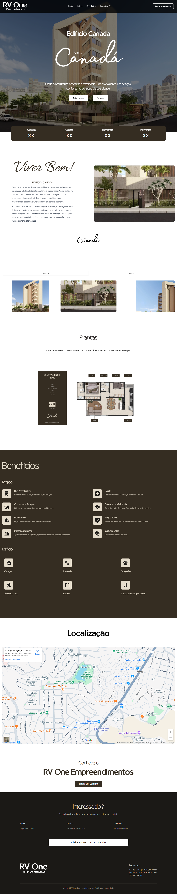

 <!-- FINAL DETAILS Project Preview -->

 <!-- INICIO DETAILS Project Details -->

└─📑 Project Details

## 🎯 Project Overview
A high-end real estate landing page for Edificio Canadá, showcasing luxury apartments with a focus on conversion and user experience.

## 🛠️ Technical Implementation
- **Framework:** Next.js 13
- **Styling:** Tailwind CSS
- **Language:** TypeScript
- **Rendering:** Server-Side Rendering (SSR)
- **Focus:** SEO optimization and performance

## 🔍 Development Role
- Implementation of pre-designed layout
- Responsive design enhancements
- SEO optimization
- Performance improvements

## ⚡ Performance Highlights
- 90+ Lighthouse score
- Optimized loading times
- Automated sitemap and robots.txt
- Dynamic meta tags

## 🎨 Key Features
- Modern and elegant landing page design
- Dedicated sections for benefits, location, and gallery
- Conversion-optimized contact form
- User experience focused on high-end real estate

## 🌟 Project Achievements
- Advanced SEO implementation with dynamic meta tags
- Responsive and accessible design
- Performance optimization
- Conversion-focused implementation

---

*Project developed as a freelance developer*

 <!-- FINAL DETAILS Project Details -->

 <!-- INICIO DETAILS Project Technologies -->

└─📑 Project Technologies

 <!-- FINAL DETAILS Project Technologies -->

### 🚗 ItuPneus - Landing Page - FEB 2025

  

 <!-- INICIO DETAILS Project Preview -->

└─📑 Project Preview

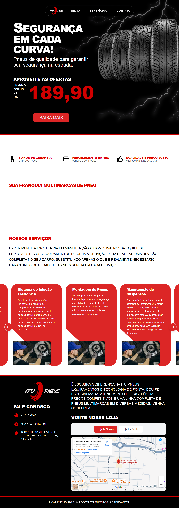

 <!-- FINAL DETAILS Project Preview -->

 <!-- INICIO DETAILS Project Details -->

└─📑 Project Details

## 🎯 Project Overview
A modern website for ItuPneus, a specialized tire and automotive services store with over 20 years of tradition. The project focused on implementing a professional design while ensuring optimal user experience and sales conversion.

## 🛠️ Technical Implementation
- **Framework:** Next.js 15
- **Language:** TypeScript
- **Styling:** Tailwind CSS
- **Rendering:** Server-Side Rendering (SSR)
- **Maps:** Google Maps Integration
- **Typography:** Google Fonts API
- **Focus:** SEO & Performance optimization

## 🔍 Key Challenges & Solutions
- Image optimization maintaining high visual quality
- Dynamic pricing system with easy updates
- Mobile-first responsive design
- Optimized contact forms implementation
- Structured sitemap and robots.txt
- WhatsApp integration for quick contact

## ⚡ Performance Metrics
- Loading time < 3 seconds
- 90+ Lighthouse score
- Fully responsive across devices
- WCAG accessibility standards
- Optimized for mobile devices

## 🎨 Key Features
- Modern and intuitive interface
- Organized service catalog
- Detailed service descriptions
- WhatsApp integration
- Location map with routes
- Strategic CTAs for conversion
- Dynamic pricing system

## 🌟 Project Achievements
- Exceptional mobile performance
- Optimized SEO for industry terms
- WCAG accessibility compliance
- Streamlined user experience
- Improved conversion rates
- Professional service presentation
- Efficient contact systems

## 📱 Service Sections
- Tire catalog and services
- Automotive maintenance
- Location and directions
- Contact information
- Company history
- Service descriptions
- Price information

---

*Project developed as a freelance developer, showcasing expertise in modern web development and UI/UX implementation*

 <!-- FINAL DETAILS Project Details -->

 <!-- INICIO DETAILS Project Technologies -->

└─📑 Project Technologies

 <!-- FINAL DETAILS Project Technologies -->

---

 <!-- FINAL DETAILS Freelance Projects -->

 <!-- INICIO DETAILS Projects With Friends -->

<h3>👥 Projects With Friends</h3>

### 🎮 Lembre de min - Visual Novel Game with [@anneanneannehp](https://www.instagram.com/anneanneannehp/)

 <!-- INICIO DETAILS Project Status -->

└─📑 Project Status

  
  

 <!-- FINAL DETAILS Project Status -->

 <!-- INICIO DETAILS Project Preview -->

└─📑 Project Preview

  

 <!-- FINAL DETAILS Project Preview -->

 <!-- INICIO DETAILS Project Details -->

└─📑 Project Details

## 🎯 Project Overview
A collaborative visual novel game project combining programming expertise with creative storytelling.

## 🛠️ Technical Stack
- **Engine:** Ren'Py Visual Novel Engine
- **Language:** Python
- **Graphics:** Custom artwork and animations
- **Audio:** Sound effects and music system
- **Status:** In Development

## 🎨 Features
- Interactive storytelling system
- Multiple story paths and endings
- Character dialogue management
- Custom artwork integration
- Sound and music implementation
- Save/Load game functionality

## 🎨 Development Focus
- Engaging narrative experience
- Intuitive user interface
- Smooth scene transitions
- Performance optimization
- Cross-platform compatibility

## 👥 Team Collaboration
- **Programming:** Ricardo Camilo
- **Art & Story:** [@anneanneannehp](https://www.instagram.com/anneanneannehp/)

## 🎯 Project Goals
- Create an engaging visual novel experience
- Implement branching storylines
- Optimize performance and loading times
- Ensure cross-platform compatibility
- Deliver polished user experience

---

*Project in active development - More features and content coming soon!*

 <!-- FINAL DETAILS Project Details -->

 <!-- INICIO DETAILS Project Technologies -->

└─📑 Project Technologies

 <!-- FINAL DETAILS Project Technologies -->

 <!-- FINAL DETAILS Projects With Friends -->

 <!-- FINAL DETAILS Projects -->

---

 <!-- INICIO Professional Profile -->

<h2>📁 Professional Profile</h2>

<table>
<tr>
<td style="background-color: #ffffff; padding: 20px;">
<picture>
<source media="(prefers-color-scheme: dark)" srcset="./assets/profile/Ricardo Camilo - Frontend Developer - Profile.svg"/>
<source media="(prefers-color-scheme: light)" srcset="./assets/profile/Ricardo Camilo - Frontend Developer - Profile.svg"/>

</picture>

<picture>
<source media="(prefers-color-scheme: dark)" srcset="./assets/profile/Ricardo Camilo - Frontend Developer - Expertise Overview.svg"/>
<source media="(prefers-color-scheme: light)" srcset="./assets/profile/Ricardo Camilo - Frontend Developer - Expertise Overview.svg"/>

</picture>

<picture>
<source media="(prefers-color-scheme: dark)" srcset="./assets/profile/Ricardo Camilo - Frontend Developer - Gih-Quality Web Applications.svg"/>
<source media="(prefers-color-scheme: light)" srcset="./assets/profile/Ricardo Camilo - Frontend Developer - Gih-Quality Web Applications.svg"/>

</picture>

<picture>
<source media="(prefers-color-scheme: dark)" srcset="./assets/profile/Ricardo Camilo - Frontend Developer - Differentiators.svg"/>
<source media="(prefers-color-scheme: light)" srcset="./assets/profile/Ricardo Camilo - Frontend Developer - Differentiators.svg"/>

</picture>

<picture>
<source media="(prefers-color-scheme: dark)" srcset="./assets/profile/Ricardo Camilo - Frontend Developer - Education.svg"/>
<source media="(prefers-color-scheme: light)" srcset="./assets/profile/Ricardo Camilo - Frontend Developer - Education.svg"/>

</picture>
</td>
</tr>
</table>

 <!-- FINAL Professional Profile -->

---

<h2>📁 Professional Contact</h2>

 <!-- FINAL Professional Contact -->

---

<h2>📁 Tech Stack & Skills</h2>

&nbsp;
&nbsp;
&nbsp;
&nbsp;

&nbsp;
&nbsp;
&nbsp;

&nbsp;
&nbsp;

&nbsp;
&nbsp;

&nbsp;
&nbsp;
&nbsp;
&nbsp;

 <!-- FINAL Tech Stack & Skills -->

---

<h2>📁 Currently Studying</h2>

 <!-- FINAL Currently Studying -->

---

<h2>📊 Certificates</h2>

### 🌐 English Proficiency - EF SET

- **Score:** 66/100 (C1 Advanced)
- **Reading:** 72/100 (C2 Mastery)
- **Listening:** 60/100 (B2 Independent)

 <!-- FINAL Certificates -->

---

<h2>☕ Support my studies</h2>

If you find my work helpful and would like to support me, you can:

### 💰 Buy me a coffee

### 

key: bc1qdgqe3a4nruxwlp5wmuajyz0d9tv4hnf26qyta6

 <!-- INICIO Bitcoin QR Code -->

Bitcoin QR Code

 <!-- FINAL Bitcoin QR Code -->

---

## 🚀 Available for Freelance Projects and Opportunities!

### Specialist in creating modern and performant web experiences

---

<!-- ## 📈 GitHub Analytics

 -->

 <!-- INICIO GitHub Analytics -->

<h2>📊 GitHub Analytics</h2>

  

 <!-- FINAL GitHub Analytics -->

---

