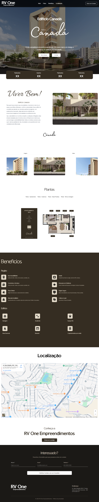
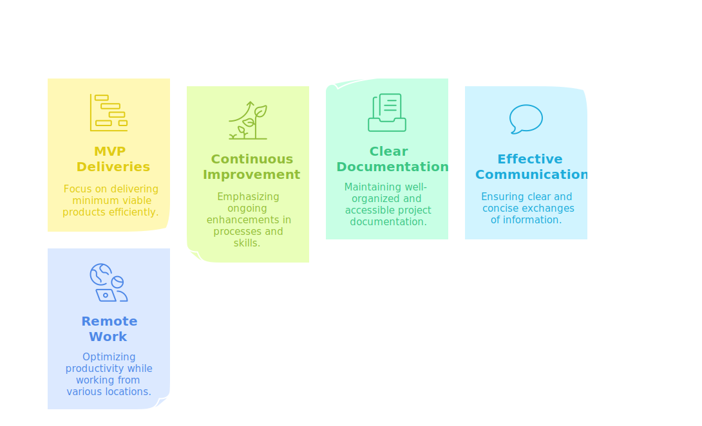
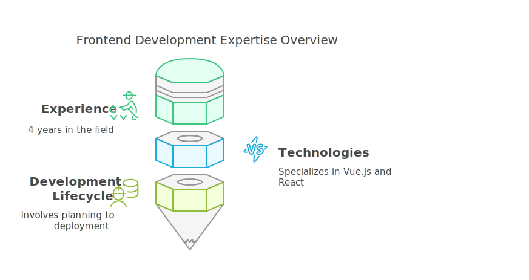
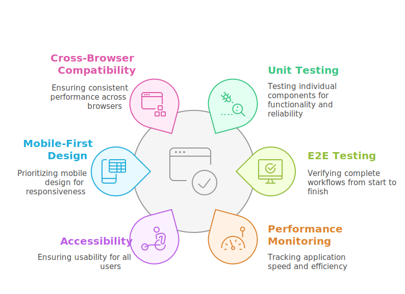
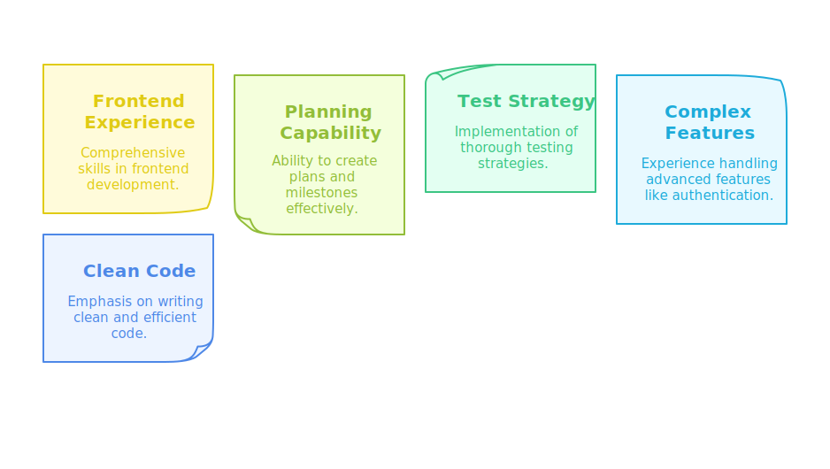
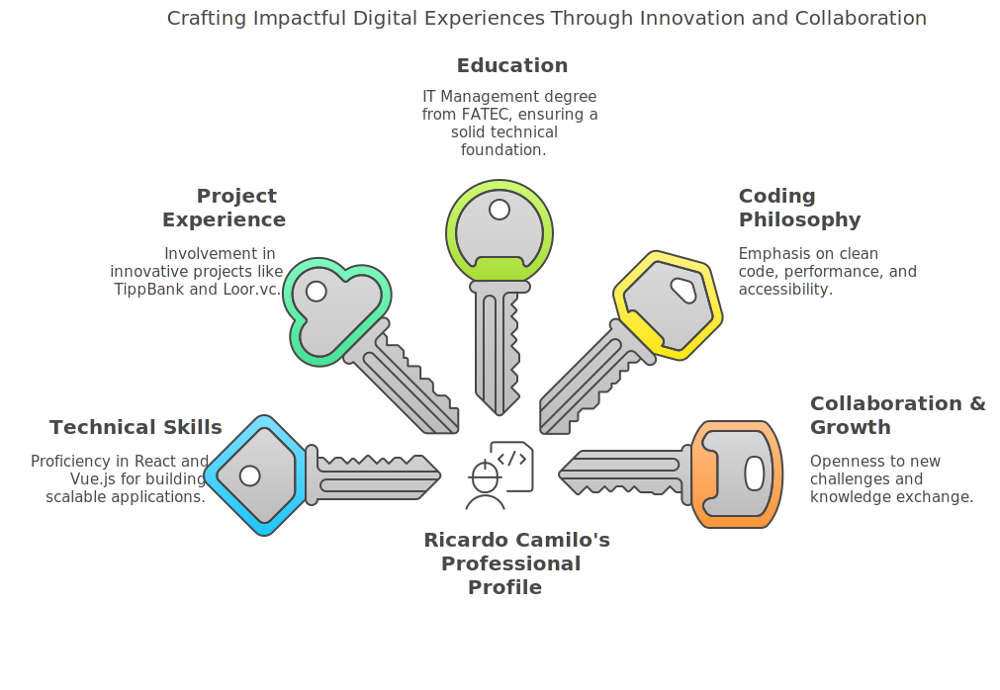

# Frontend Developer Specialist in Vue/React.js 🚀

---

## 📁 Projects

### 🗂️ Personal Projects

#### 🗺️ Chronicles (TypeScript/JavaScript)

##### 🌿 Breath Natural - NextJS

📑 Project Status

- 
- 

📑 Project Details

**🎯 Project Overview**  
A modern e-commerce platform for indoor plants, developed as a portfolio piece to demonstrate advanced frontend development capabilities.

**🛠️ Technical Implementation**  
- Framework: Next.js  
- Styling: Tailwind CSS  
- Features:  
  - Dynamic routing and state management  
  - Interactive shopping cart functionality  
  - Clean and maintainable code architecture  
  - Integration with UI components  
  - Performance optimization  
  - SEO best practices  

**✨ Key Features**  
- Elegant and modern UI design  
- Responsive layout for all devices  
- Product catalog with detailed plant information  
- Shopping cart functionality  
- User testimonials section  
- Interactive product navigation  
- Smooth animations and transitions  
- Multi-language support (PT/EN)

**🎨 Design & Development**  
The project features a minimalist and nature-inspired design, focusing on user experience and visual appeal.

**🔧 Technologies Used**  
- Next.js  
- Tailwind CSS  
- TypeScript  
- Google Tag Manager, Google Analytics  
- Netlify  

**🎯 Learning Outcomes**  
- Component architecture implementation  
- State management solutions  
- Responsive design techniques  
- Performance optimization strategies  
- Clean code principles  
- Version control with Git  

📑 Project Preview

📑 Project Technologies

  
  
  
  
  
  
  
  
  
  
  

##### 🍽️ Food Hut - Angular

📑 Project Status

- 
- 

📑 Project Details

**🎯 Project Overview**  
A modern restaurant landing page developed to demonstrate proficiency in Angular and modern web development practices.

**🛠️ Technical Implementation**  
- Framework: Angular  
- Styling: Tailwind CSS  
- Features:  
  - Progressive Web App (PWA) capabilities  
  - Mobile-first development  
  - Component-based architecture  

**✨ Key Features**  
- Modern, responsive design  
- Mobile-optimized interface  
- Fast loading times  
- Smooth animations  
- Interactive UI elements  

**🔧 Technologies Used**  
- Angular  
- Tailwind CSS  
- Google Analytics  

**🎯 Learning Outcomes**  
- Angular component architecture  
- TypeScript implementation  
- Modern CSS practices  
- Performance optimization  

🎥 Video Preview

📑 Project Technologies

  
  
  
  
  
  
  
  

##### 🦁 Savana - NuxtJS

📑 Project Status

- 
- 

📑 Project Preview

📑 Project Details

**🎯 Project Overview**  
A portfolio project showcasing frontend development skills using NuxtJS.

**🛠️ Technical Stack**  
- Framework: NuxtJS  
- State Management: Pinia  
- Styling: Tailwind CSS  
- Languages: TypeScript/JavaScript  
- Internationalization: i18n  

**✨ Key Features**  
- Multi-language support (English/Portuguese)  
- Favorites system implementation  
- Responsive design for all devices  
- Modern and clean UI/UX  
- Global state management with Pinia  

**🎯 Learning Outcomes**  
- Experience with NuxtJS ecosystem  
- State management patterns  
- Responsive design practices  
- Internationalization implementation  

📑 Project Technologies

  
  
  
  
  
  
  
  
  
  

##### 🎭 Persona - NextJS

📑 Project Status

- 
- 

📑 Project Preview

📑 Project Details

**📝 Description**  
A modern, responsive portfolio website showcasing 4+ years of expertise in transforming business challenges into high-impact digital solutions.

**🛠️ Technical Implementation**  
- Built with Next.js for optimal performance  
- Responsive design for all devices  
- Multi-language support (English/Portuguese)  
- Performance optimized with 90+ Lighthouse score  

**💻 Tech Stack**  
- Next.js  
- TypeScript  
- Tailwind CSS  
- Netlify  

**🎨 Key Features**  
- Clean, minimalist design  
- Project showcase with live demos  
- Detailed technology stack presentation  
- Contact form integration  

**📱 Highlighted Projects**  
- 🪴 [Breath Natural](https://breath-natural-nextjs-chronicles.netlify.app/)  
- 🍽️ [Food Hut](https://food-hut-angular-chronicles-1.netlify.app/)  
- 🦁 [Savana](https://savana-nuxtjs-chronicles-part-1.netlify.app/en)  

📑 Project Technologies

  
  
  
  
  
  
  
  
  
  

##### 🌟 Zenith - NodeJS

📑 Project Status

- 
- 

📑 Project Preview

📑 Project Details

**🎯 Learning Objectives**  
- Creation of a native HTTP server in Node.js  
- Page routing  
- File manipulation  
- Error handling  
- Basic internationalization (i18n)  
- Basic security (path sanitization)  

**🛠️ Technologies Used**  
- Node.js  
- TypeScript  
- HTML  
- Git  
- Replit  

**🚀 Implemented Features**  
- Custom HTTP server without frameworks  
- Manual routing system  
- Support for multiple languages (PT/EN)  
- 404 error handling  
- Path sanitization  

📑 Project Technologies

  
  
  
  
  
  

### 🤝 Freelance Projects

#### 🏢 Edificio Canadá - Landing Page

📑 Project Status

- 
- 

📑 Project Preview

📑 Project Details

**🎯 Project Overview**  
A high-end real estate landing page for Edificio Canadá, showcasing luxury apartments with a focus on conversion and user experience.

**🛠️ Technical Implementation**  
- Framework: Next.js 13  
- Styling: Tailwind CSS  
- Language: TypeScript  
- Rendering: Server-Side Rendering (SSR)  
- Focus: SEO optimization and performance  

**🎨 Key Features**  
- Modern and elegant landing page design  
- Dedicated sections for benefits, location, and gallery  
- Conversion-optimized contact form  

**⚡ Performance Highlights**  
- 90+ Lighthouse score  
- Optimized loading times  
- Dynamic meta tags  

📑 Project Technologies

  
  
  
  
  
  

### 👥 Projects With Friends

#### 🎮 Lembre de min - Visual Novel Game with Anne

📑 Project Status

- 
- 

📑 Project Details

**🎯 Project Overview**  
A visual novel game in collaboration with [@anneanneannehp](https://www.instagram.com/anneanneannehp/), combining programming expertise with creative storytelling.

**🛠️ Technical Stack**  
- Engine: Ren'Py  
- Language: Python  
- Graphics: Custom artwork and animations  

**🎨 Features**  
- Interactive storytelling  
- Multiple story paths  
- Character dialogue system  
- Sound and music implementation  

**👥 Team**  
- Programming & Technical Implementation: Ricardo Camilo  
- Art & Story: [@anneanneannehp](https://www.instagram.com/anneanneannehp/)  

📑 Project Technologies

  
  

---

## 📁 Professional Profile

  
  
  
  

---

## 📁 Professional Contact

  
  
  
  

---

## 📁 Tech Stack & Skills

  
  
  
  
  
  
  
  
  
  
  
  
  
  
  
  
  
  
  
  
  

---

## 📁 Currently Studying

  
  

---

## 📊 Certificates

### 🌐 English Proficiency - EF SET

  
- Score: 66/100 (C1 Advanced)  
- Reading: 72/100 (C2 Mastery)  
- Listening: 60/100 (B2 Independent)

---

## ☕ Support my Studies

If you find my work helpful, consider supporting me!

### 💰 Buy me a Coffee

### Bitcoin Donation

Address: `bc1qdgqe3a4nruxwlp5wmuajyz0d9tv4hnf26qyta6`

Bitcoin QR Code

---

## 🚀 Available for Freelance Projects and Opportunities!

**Specialist in creating modern and performant web experiences**

---

## 📊 Profile Views

